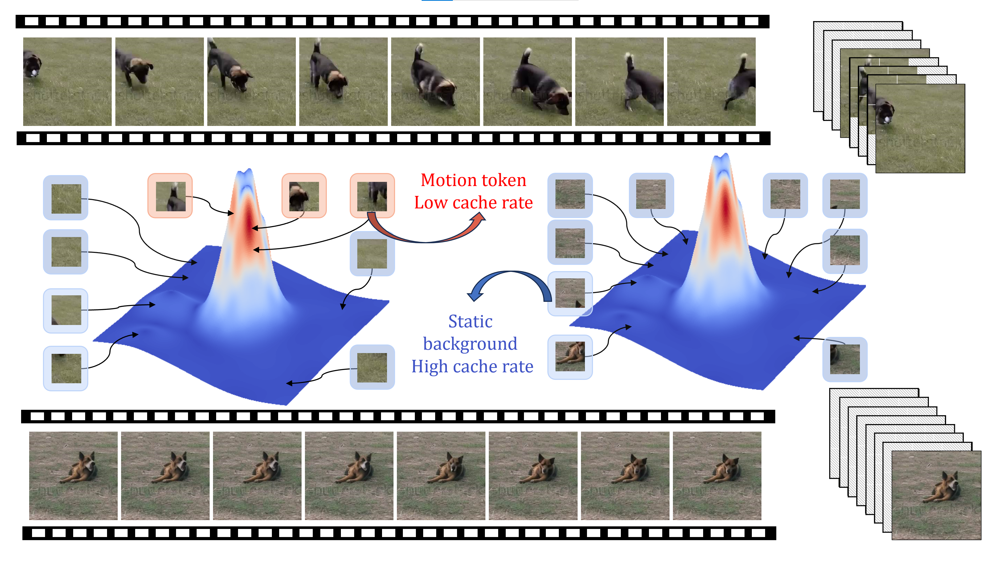
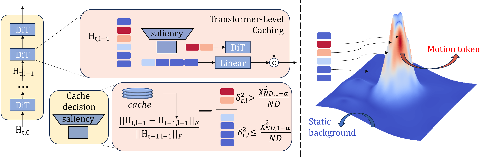

<div align="center">
  <!-- <h1>KTransformers</h1> -->
  <p align="center">

  <picture>
    

  </p>
  <h3>FastCache-xDiT: A Plug-and-Play Acceleration Method for Diffusion Transformers</h3>
  <a href="#cite-us">📝 Papers</a> | <a href="#QuickStart">🚀 Quick Start</a> | <a href="#support-dits">🎯 Supported DiTs</a> | <a href="#fastcache-overview">⚡ FastCache </a></strong>
  <p></p>

</div>

<h2 id="agenda">Table of Contents</h2>

- [🔥 FastCache-xDiT](#fastcache-overview)
- [🚀 QuickStart](#QuickStart)
- [🎯 Supported DiTs](#support-dits)
- [📊 Performance Comparison](#performance-comparison)
- [🧠 Technical Details](#technical-details) 
- [📈 xDiT's Parallel Methods](#parallel)
- [🔍 Single GPU Acceleration](#1gpuacc)
- [📚 Develop Guide](#dev-guide)
- [📝 Cite Us](#cite-us)

<h2 id="fastcache-overview">🔥 FastCache-xDiT</h2>

FastCache-xDiT is a novel **plug-and-play acceleration method** for Diffusion Transformers (DiTs) that exploits computational redundancies across both spatial and temporal dimensions. With **zero training required** and **minimal quality impact**, FastCache can deliver significant speedups (up to 1.7x) on modern DiT models while being fully compatible with existing parallel inference methods.

### Key Features

- **Plug-and-Play**: Drop-in acceleration with no model modifications required
- **Adaptive Computation**: Dynamically adjusts caching behavior based on model hidden states
- **Spatial-Temporal Awareness**: Intelligently identifies redundant computations in both dimensions
- **Memory Efficient**: Reduces peak memory usage by avoiding unnecessary computations
- **Compatible with Parallel Methods**: Can be combined with USP, PipeFusion, and other xDiT parallel techniques

FastCache introduces a hidden-state-level caching and compression framework with two core components:

1. **Spatial Token Reduction Module** - Adaptively identifies and processes only tokens with significant changes
2. **Transformer-Level Caching Module** - Uses statistical tests to determine when entire transformer blocks can be skipped

<picture>
  
</picture>

<picture>
  
</picture>

<picture>
  
</picture>

<h2 id="performance-comparison">📊 Performance Comparison</h2>

FastCache delivers significant speedups across popular DiT models:

| Model | Baseline | FastCache | TeaCache | First-Block-Cache |
|-------|----------|-----------|----------|------------------|
| Flux.1 | 9.8s | 6.2s (1.6x) | 7.1s (1.4x) | 7.5s (1.3x) |
| PixArt Sigma | 10.6s | 6.7s (1.6x) | 6.9s/(1.6x) | 6.8s/(1.6x) |

<h2 id="technical-details">🧠 Technical Details</h2>

FastCache-xDiT operates on two levels, using learnable parameters to approximate redundant computations:

### Spatial Token Reduction

FastCache computes a motion-aware saliency metric by comparing hidden states between timesteps:

$$S_t^{(i)} = \|X_t^{(i)} - X_{t-1}^{(i)}\|_2^2$$

Each token is classified as either motion or static based on a threshold $\tau_s$:

$$\mathcal{M}_t = \{i : S_t^{(i)} > \tau_s\}, \quad X_t^m = X_t[\mathcal{M}_t], \quad X_t^s = X_t[\bar{\mathcal{M}}_t]$$

Motion tokens $X_t^m$ are processed through the full transformer stack, while static tokens $X_t^s$ are processed with a learnable linear projection:

$$H_t^s = W_s X_t^s + b_s$$

This spatial token reduction significantly reduces computation by only applying full transformer processing to tokens with significant changes.

### Transformer-Level Caching

For each transformer block, FastCache computes a relative change metric between current and previous hidden states:

$$\delta_{t,l} = \frac{\Vert H_{t,l-1} - H_{t-1,l-1}\Vert_F}{\Vert H_{t-1,l-1}\Vert_F}$$

Under statistical assumptions, this metric follows a scaled $\chi^2$ distribution:

$$(ND) \cdot \delta_{t,l}^2 \sim \chi^2_{ND}$$

FastCache applies a cache decision rule: for confidence level $1-\alpha$, the transformer block is skipped if:

$$\delta_{t,l}^2 \leq \frac{\chi^2_{ND, 1-\alpha}}{ND}$$

Instead of computing the full transformer block, FastCache uses a block-specific learnable linear projection:

$$H_{t,l} = W_l H_{t,l-1} + b_l$$

This provides a statistically sound method to decide when hidden states can be reused, while the learnable parameters ensure output quality is maintained.

### Adaptive Thresholding

FastCache includes an adaptive thresholding mechanism that adjusts based on timestep and variance:

$$\tau_{adaptive} = \beta_0 + \beta_1 S_{var} + \beta_2 t + \beta_3 t^2$$

Where $\beta_0$, $\beta_1$, $\beta_2$, and $\beta_3$ are parameters that control the adaptation, and $t$ is the timestep.

### FastCache Algorithm

```
Algorithm: FastCache
Input: Hidden state H_t, previous hidden H_{t-1}, Transformer blocks, thresholds τ_s, α
Output: Processed hidden state H_t^L

1. Compute token-wise saliency S_t ← ||H_t - H_{t-1}||_2^2
2. Partition tokens into motion tokens X_t^m and static tokens X_t^s based on τ_s
3. Initialize H_{t,0} ← Concat(X_t^m, X_t^s)
4. For l = 1 to L:
   a. δ_{t,l} ← ||H_{t,l-1} - H_{t-1,l-1}||_F / ||H_{t-1,l-1}||_F
   b. If δ_{t,l}^2 ≤ χ^2_{ND, 1-α}/ND:
      i. H_{t,l} ← W_l H_{t,l-1} + b_l  (Linear approximation)
   c. Else:
      i. H_{t,l} ← Block_l(H_{t,l-1})  (Full computation)
5. Return H_t^L
```

This approach provides significant speedups (up to 1.7x) with minimal impact on generation quality by intelligently skipping redundant computations at both the token and transformer block levels.

<h2 id="QuickStart">🚀 QuickStart</h2>

### 1. Install xFuser

```bash
pip install xfuser  # Basic installation
pip install "xfuser[diffusers,flash-attn]"  # With both diffusers and flash attention
```

### 2. Using FastCache Acceleration

#### Python API

```python
from xfuser.model_executor.pipelines.fastcache_pipeline import xFuserFastCachePipelineWrapper
from diffusers import PixArtSigmaPipeline

# Load your diffusion model
model = PixArtSigmaPipeline.from_pretrained("PixArt-alpha/PixArt-Sigma-XL-2-1024-MS")

# Create FastCache wrapper
fastcache_wrapper = xFuserFastCachePipelineWrapper(model)

# Enable FastCache with optional parameters
fastcache_wrapper.enable_fastcache(
    cache_ratio_threshold=0.05,  # Relative change threshold for caching
    motion_threshold=0.1,        # Threshold for motion saliency
)

# Run inference with FastCache acceleration
result = fastcache_wrapper(
    prompt="a photo of an astronaut riding a horse on the moon",
    num_inference_steps=30,
)

# Get cache statistics
stats = fastcache_wrapper.get_cache_statistics()
print(stats)
```

#### Command Line Usage

Run FastCache with PixArt Sigma:

```bash
# Basic usage
python examples/run_fastcache_test.py \
    --model_type pixart \
    --model "PixArt-alpha/PixArt-Sigma-XL-2-1024-MS" \
    --prompt "a photo of an astronaut riding a horse on the moon" \
    --num_inference_steps 30 \
    --cache_method "Fast" \
    --cache_ratio_threshold 0.05 \
    --motion_threshold 0.1

# Using the convenience benchmark script to compare different cache methods
./examples/run_fastcache_benchmark.sh pixart
```

Run FastCache with Flux model:

```bash
# Basic usage
python examples/run_fastcache_test.py \
    --model_type flux \
    --model "black-forest-labs/FLUX.1-schnell" \
    --prompt "a serene landscape with mountains and a lake" \
    --num_inference_steps 30 \
    --cache_method "Fast" \
    --cache_ratio_threshold 0.05 \
    --motion_threshold 0.1

# Using the convenience benchmark script
./examples/run_fastcache_benchmark.sh flux
```

### 2. Using FastCache Acceleration Benchmark compared to other Acceleration Methods

```bash
python benchmark/cache_execute.py \
  --model_type pixart \
  --cache_methods None Fast Fb Tea \
  --num_inference_steps 20 \
  --height 512 \
  --width 512 \
  --output_dir cache_results
```

```bash
python benchmark/cache_execution_xfuser.py --model_type pixart --cache_methods Fast --num_inference_steps 5 --height 256 --width 256 --output_dir test_results
```


#### Command Line Arguments

| Argument | Description | Default |
|----------|-------------|---------|
| `--model_type` | Model type (`pixart`, `flux`) | `pixart` |
| `--model` | Model path or name | `PixArt-alpha/PixArt-Sigma-XL-2-1024-MS` |
| `--prompt` | Text prompt for image generation | `a photo of an astronaut riding a horse on the moon` |
| `--num_inference_steps` | Number of inference steps | `30` |
| `--cache_method` | Cache method (`None`, `Fast`, `Fb`, `Tea`) | `Fast` |
| `--seed` | Random seed | `42` |
| `--height` | Image height | `768` |
| `--width` | Image width | `768` |
| `--cache_ratio_threshold` | Cache ratio threshold | `0.05` |
| `--motion_threshold` | FastCache motion threshold | `0.1` |
| `--output_dir` | Output directory for results | `fastcache_test_results` |

### 3. Benchmark FastCache

Compare FastCache with other acceleration methods:

```bash
# Run on PixArt Sigma
./examples/run_fastcache_benchmark.sh pixart

# Run on Flux model
./examples/run_fastcache_benchmark.sh flux
```

The benchmark will:
- Run baseline model without acceleration (cache_method="None")
- Run with FastCache acceleration (cache_method="Fast")
- Run with First-Block-Cache acceleration (cache_method="Fb")
- Run with TeaCache acceleration (cache_method="Tea")
- Generate comparison images for quality assessment
- Create performance statistics and cache hit ratio charts
- Generate a comprehensive HTML report with all comparisons

All results will be saved to the `fastcache_benchmark_results` directory, making it easy to compare the different caching methods in terms of both performance and output quality.

### 4. Combining with Parallel Methods

FastCache can be combined with xDiT's parallel methods for even greater speedups:

```python
# Enable FastCache in your pipeline
fastcache_wrapper = xFuserFastCachePipelineWrapper(model)
fastcache_wrapper.enable_fastcache()

# Apply parallel inference (USP, PipeFusion, etc.)
engine_config, input_config = engine_args.create_config()
paralleler = xDiTParallel(fastcache_wrapper, engine_config, input_config)

# Run inference with both FastCache and parallel acceleration
result = paralleler(prompt="your prompt", num_inference_steps=30)
```

<h2 id="support-dits">🎯 Supported DiTs</h2>

<div align="center">

| Model Name | FastCache | CFG | SP | PipeFusion | Performance Report Link |
| --- | --- | --- | --- | --- | --- |
| [🟠 Flux](https://huggingface.co/black-forest-labs/FLUX.1-schnell) | ✅ | NA | ✔️ | ✔️ | [Report](./docs/performance/flux.md) |
| [🔴 PixArt-Sigma](https://huggingface.co/PixArt-alpha/PixArt-Sigma-XL-2-1024-MS) | ✅ | ✔️ | ✔️ | ✔️ | [Report](./docs/performance/pixart_alpha_legacy.md) |
| [🎬 HunyuanDiT-v1.2-Diffusers](https://huggingface.co/Tencent-Hunyuan/HunyuanDiT-v1.2-Diffusers) | ✅ | ✔️ | ✔️ | ✔️ | [Report](./docs/performance/hunyuandit.md) |
| [🎬 StepVideo](https://huggingface.co/stepfun-ai/stepvideo-t2v) | ✅ | NA | ✔️ | ❎ | [Report](./docs/performance/stepvideo.md) |
| [🟢 PixArt-alpha](https://huggingface.co/PixArt-alpha/PixArt-alpha) | ✅ | ✔️ | ✔️ | ✔️ | [Report](./docs/performance/pixart_alpha_legacy.md) |
| [🎬 ConsisID-Preview](https://github.com/PKU-YuanGroup/ConsisID) | ✅ | ✔️ | ✔️ | ❎ | [Report](./docs/performance/consisid.md) |
| [🎬 CogVideoX1.5](https://huggingface.co/THUDM/CogVideoX1.5-5B) | ✅ | ✔️ | ✔️ | ❎ | [Report](./docs/performance/cogvideo.md) |

</div>

<h2 id="parallel">📈 FastCache-xDiT's Cache Methods</h2>

FastCache-xDiT is fully compatible with the parallel acceleration methods provided by xDiT, this repo offers multiple cache-based acceleration methods:

1. **FastCache**: Our adaptive spatial-temporal caching method that uses motion-aware token reduction and statistical caching to exploit computational redundancies. [Read more about FastCache](./docs/methods/fastcache.md).

2. **TeaCache**: Memory-friendly caching and generation to exploit redundancies between adjacent denoising steps.

3. **First-Block-Cache**: Caches the output of early transformer blocks across timesteps.

### Using FastCache for Video Generation

FastCache also works with video generation models. Here are examples of how to use it with different video DiT models:

```bash
# Using FastCache with StepVideo
python benchmark/video_cache_execute.py \
  --model_type stepvideo \
  --prompt "a dog running in a field" \
  --cache_methods Fast \
  --num_inference_steps 20 \
  --num_frames 16 \
  --height 256 \
  --width 256 \
  --cache_ratio_threshold 0.15

# Using FastCache with CogVideoX
python benchmark/video_cache_execute.py \
  --model_type cogvideox \
  --prompt "a dog running in a field" \
  --cache_methods Fast \
  --num_inference_steps 20 \
  --num_frames 16

# Using FastCache with ConsisID
python benchmark/video_cache_execute.py \
  --model_type consisid \
  --prompt "a time lapse of a blooming flower" \
  --cache_methods Fast \
  --num_inference_steps 20 \
  --num_frames 16

# Compare all cache methods (None, Fast, Fb, Tea) on video generation
python benchmark/video_cache_execute.py \
  --model_type stepvideo \
  --cache_methods All \
  --num_frames 16 \
  --num_inference_steps 20
```

<h2 id="dev-guide">📚 Develop Guide</h2>

We provide a step-by-step guide for adding new models, please refer to the following tutorial.

<h2 id="cite-us">📝 Cite Us</h2>

If you use FastCache-xDiT in your research or applications, please cite:

```bibtex
@inproceedings{liu2025fastcache,
  title={FastCache: Cache What Matters, Skip What Doesn't.},
  author={Liu, Dong and Zhang, Jiayi and Li, Yifan and Yu, Yanxuan and Lengerich, Ben and Wu, Ying Nian},
  booktitle={Proceedings of the IEEE/CVF Conference on Computer Vision and Pattern Recognition (CVPR) Workshops},
  year={2025}
}
@article{liu2025fastcache,
  title={FastCache: Fast Caching for Diffusion Transformer Through Learnable Linear Approximation},
  author={Liu, Dong and Zhang, Jiayi and Li, Yifan and Yu, Yanxuan and Lengerich, Ben and Wu, Ying Nian},
  journal={arXiv preprint arXiv:2505.20353},
  year={2025}
}
```

## Contact

For questions about FastCache-xDiT, please contact [dong.liu.dl2367@yale.edu](mailto:dong.liu.dl2367@yale.edu).
